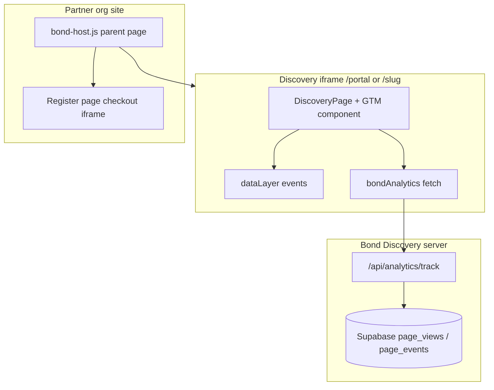

# Analytics — Discovery, portal iframe, and host shell

**Purpose:** Single source of truth for what is implemented, what fires in production, and how partner host shell affects measurement.  
**Related:** [GTM Setup (admin UI)](/admin/help/gtm-setup) · [Partner integration](./partner-host-integration.md) · [Portal design spec](./portal-session-first-design-spec.md)

---

## Two parallel systems

Bond Discovery uses **two** tracking channels. Most UI actions should fire **both** (several do; some only fire one).

| System | Mechanism | Storage / destination | Config |
|--------|-----------|----------------------|--------|
| **GTM / GA4** | `window.dataLayer.push` via `gtmEvent.*` | Partner GA4 (and Bond system container if set) | Page `gtmId`, partner group `gtm_id`, env `NEXT_PUBLIC_BOND_GTM_ID` |
| **Bond internal** | `POST /api/analytics/track` via `bondAnalytics.*` | Supabase `page_views`, `page_events` | Always on; view in `/admin/analytics` |



**Important:** GTM loads **inside the discovery iframe document**, not on the partner’s top-level Webflow page (unless the partner adds their own GTM there separately).

---

## Where GTM loads

`DiscoveryPage` renders:

```tsx
<GoogleTagManager gtmId={config.gtmId} pageSlug={config.slug} />
```

Containers loaded (deduped):

1. `NEXT_PUBLIC_BOND_GTM_ID` — Bond system container (all pages)
2. `config.gtmId` — page override, else inherited from partner group

On mount, dataLayer gets context:

```js
{ bond_page_slug, bond_timestamp }
```

**Portal route (`/portal/{slug}`):** Same `DiscoveryPage` → same GTM behavior as public slug page.

**Register / checkout tab:** Consumer app iframe on org domain — **not** this repo. Tracking depends on consumer GTM (Bond eng / help center). Discovery GTM does **not** see checkout funnel events unless you forward them (not implemented in `bond-host` today).

---

## Bond internal analytics

| Endpoint | `type` | Fields |
|----------|--------|--------|
| `POST /api/analytics/track` | `pageview` | `pageSlug`, `viewMode`, `scheduleView` |
| `POST /api/analytics/track` | `event` | `pageSlug`, `eventType`, `eventData` |

Migration: `migrations/002_add_analytics_tracking.sql`  
Dashboard: `/admin/analytics` (requires migration applied)

`bondAnalytics.pageView` runs **once on mount** (`DiscoveryPage` useEffect, deps `[config.slug]` only — tab changes do not re-send pageview).

---

## GTM event catalog

### Implemented and wired in UI

| Event | Trigger locations | GTM | Bond internal |
|-------|-------------------|-----|---------------|
| `click_register` | `ProgramCard`, `ScheduleView`, `PricingCarousel` (via card) | Yes | Yes |
| `filter_applied` | `FilterBar`, `HorizontalFilterBar`, `MobileFilters` | Yes | **No** (GTM only) |
| `view_mode_changed` | `DiscoveryPage` tab Programs ↔ Schedule | Yes | Yes |
| `share_link` | `DiscoveryPage` share button | Yes | Yes |
| `click_redeem_pass` | `lib/schedule-redeem.ts` | Yes | Yes |
| `perf_time_to_content` | `DiscoveryPage` (load timing) | Yes | No |
| `perf_events_fetch` | `DiscoveryPage` (schedule fetch timing) | Yes | No |

**`click_register` payload (typical):**

```json
{
  "event": "click_register",
  "program_id": "3817",
  "program_name": "Flag Football",
  "session_id": "87596",
  "session_name": "Winter 2 - 12U Coed",
  "product_id": "119110",
  "price": 299,
  "currency": "USD"
}
```

Program-level register often omits `session_id` / `product_id`. Session card with single product includes `product_id` and `price`.

### Defined in code but NOT wired in UI

These exist in `components/analytics/GoogleTagManager.tsx` and tests only — **never called** from components today:

| Event | Intended use |
|-------|----------------|
| `page_view` | `gtmEvent.pageView` — unused (GA4 often uses GTM built-in page view instead) |
| `view_program` | Program card expand / detail view |
| `view_session` | Session detail view |
| `schedule_view_changed` | Schedule sub-view (list / table / day / week / month) |
| `click_event` | Calendar event click |

**Action for Phase 2:** Wire `schedule_view_changed` when portal schedule tab ships; consider `view_session` on session card expand.

### Bond internal only (no GTM mirror)

None beyond the table above — `filter_applied` is GTM-only today.

---

## Host shell and portal — measurement gaps

### 1. Portal register clicks (fixed)

`HostShellPortalBridge` fires `trackHostShellRegisterClick()` **before** `preventDefault`, via `lib/host-shell/registration-analytics.ts` (IDs parsed from href; names fall back to IDs until DOM metadata is added).

**Limitation:** `program_name` / `session_name` in dataLayer are IDs, not display names, unless you later add `data-*` on anchors in portal-only components.

### 2. Two tabs, two documents

| Step | Document | GTM |
|------|----------|-----|
| Browse programs | Discovery iframe | Partner + Bond containers in iframe |
| Register click | Same iframe (if tracking works) | Same |
| Checkout | **New tab** — consumer iframe | Consumer’s GTM only (if configured) |

Funnel reporting in **partner GA4** needs either:

- Cross-domain linker / GA4 measurement ID on both org site + consumer, or  
- GTM on org **register** page listening for iframe/postMessage (not built), or  
- Bond system GTM in consumer (product decision)

`bond-host.js` does **not** forward discovery dataLayer events to the parent page.

### 3. Share link URL in portal iframe

`share_link` uses `window.location.href` → `https://discovery.bondsports.co/portal/{slug}?...`, not org-domain URL. Partners may care; optional future: `hostContext` aware share URL.

### 4. iframe resize (not analytics)

`DiscoveryPage` posts `discovery-resize` to parent; `bond-host` listens (`bond:resize` + legacy). Unrelated to GA4 but required for embed UX.

---

## How to verify (works today?)

### GTM Preview

1. Configure `gtmId` on page or partner in admin.  
2. Enable GTM Preview mode.  
3. Open **`https://discovery.bondsports.co/{slug}`** (or `/portal/{slug}` in iframe).  
4. Actions: apply filter → `filter_applied`; switch Programs/Schedule → `view_mode_changed`; click Register on **standalone** slug page → `click_register`.  
5. For **portal host shell**, repeat Register click inside iframe — **confirm whether `click_register` appears** (known gap).

### Bond admin dashboard

1. Run migrations `001_add_gtm_tracking.sql`, `002_add_analytics_tracking.sql`.  
2. Visit discovery page, click register (on non-portal-intercepted link).  
3. Open `/admin/analytics` — check page views and `click_register` events.

### Automated tests

| Test file | Covers |
|-----------|--------|
| `__tests__/components/GoogleTagManager.test.ts` | All `gtmEvent.*` helpers |
| `__tests__/lib/analytics.test.ts` | `bondAnalytics` POST payloads |
| `__tests__/components/discovery/ProgramCard.test.tsx` | Register click tracking |
| `e2e/discovery.spec.ts` | dataLayer exists / interaction bump |

No e2e for `/portal` + host bridge yet.

---

## Partner GA4 setup (discovery)

In-app guide: **`/admin/help/gtm-setup`** (subset of events; missing perf + redeem + portal notes).

Recommended GTM triggers (Custom Event):

| Trigger name | Event name |
|--------------|------------|
| CE - Click Register | `click_register` |
| CE - Filter Applied | `filter_applied` |
| CE - View Mode Changed | `view_mode_changed` |
| CE - Share Link | `share_link` |
| CE - Schedule View Changed | `schedule_view_changed` (only after wired) |

Map Data Layer Variables → GA4 Event parameters per admin guide.

---

## Checkout / consumer (Bond register page)

This repo does **not** implement consumer checkout analytics. Partners referencing “great register documentation” usually mean:

- Bond Help Center conversion analytics collection, or  
- Consumer app GTM (separate codebase)

**Host shell checkout URL shape:**

```
https://{partner}/discovery/register?bondPath=/programs/{program}/session/{session}?skipToProducts=true&productId={id}
```

`bond-host` loads `{consumerOrigin}{bondPath}` in iframe.

**For end-to-end funnels:** align GA4 property, domains, and GTM on: (1) discovery iframe, (2) org register shell page (optional), (3) consumer checkout iframe.

---

## Recommended engineering backlog

| Priority | Item |
|----------|------|
| ~~P0~~ | ~~Fix portal `click_register` tracking~~ — done in `registration-analytics.ts` |
| P1 | Wire `schedule_view_changed` in `ScheduleView` |
| P1 | Mirror `filter_applied` to `bondAnalytics` for internal dashboard |
| P2 | `view_session` on session card expand (portal Phase 2) |
| P2 | `bond-host` optional `postMessage` to parent: `bond:analytics` forwarder |
| P3 | Portal-aware share URL for org-domain marketing links |
| P3 | Extend `/admin/help/gtm-setup` to link this doc + host shell section |

---

## Code reference

| Piece | Path |
|-------|------|
| GTM component + `gtmEvent` | `components/analytics/GoogleTagManager.tsx` |
| Bond internal client | `lib/analytics.ts` |
| Track API | `app/api/analytics/track/route.ts` |
| Stats API | `app/api/analytics/stats/route.ts` |
| Page view mount | `components/discovery/DiscoveryPage.tsx` |
| Register tracking | `components/discovery/ProgramCard.tsx`, `ScheduleView.tsx` |
| Portal bridge | `components/host-shell/HostShellPortalBridge.tsx` |
| Parent script | `public/bond-host/v1.js` |
